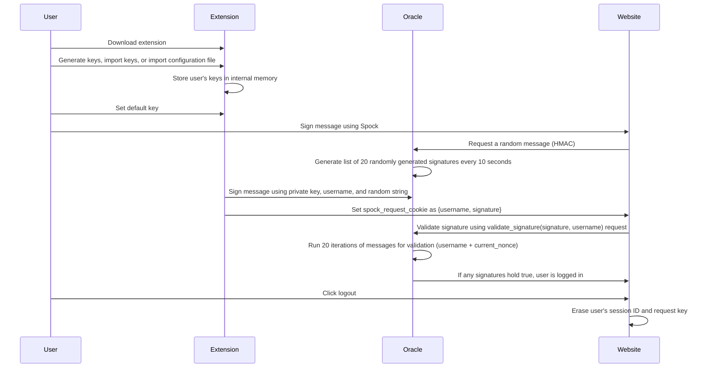

## Project Summary

## Abstract

Spock is a browser extension that offers a secure and passwordless authentication method for users. Traditional password-based authentication systems are susceptible to various attacks, such as brute-force attacks, password guessing, and phishing. To address these vulnerabilities, Spock leverages public-key cryptography and a decentralized trust model for user authentication. This paper provides an overview of the Spock protocol, its motivation, implementation details, and related works.

https://github.com/SpockExtension/Spock/assets/36011576/44e525b6-4c3a-4df4-a769-a68135184ae9





## 1. Introduction

Spock aims to provide a more secure alternative to traditional password-based authentication systems by eliminating the need for passwords altogether. Passwords are often weak, reused across multiple platforms, and vulnerable to various attacks. Spock utilizes public-key cryptography, where users generate a pair of public and private keys. The private key remains securely stored on the user's computer, while the public key is registered with a trusted Oracle server. When a user wants to authenticate with a website supporting Spock, they sign a message with their private key, and the website verifies the signature using the user's public key and the trusted Oracle. This approach enhances security by preventing password interception and reducing the risk of key theft.

## 2. Motivation

The motivation behind Spock is to provide a convenient and secure passwordless authentication solution. Existing passwordless systems, such as Magic Link, often lack a user-friendly interface. Spock was inspired by the use of SSH keys in applications like Bandit, Metamask, and Nostr. The goal was to develop a system that combines the security benefits of public-key cryptography with a decentralized trust model while ensuring a seamless user experience.

## 3. Overview

### 3.1 Why use Spock?

Spock offers several advantages over traditional password-based authentication systems:

- Enhanced Security: Spock eliminates the vulnerabilities associated with passwords, such as brute-force attacks, password guessing, and phishing. The private key remains on the user's computer, making it difficult for attackers to steal it.

- Password Interception Prevention: Since the signature and a random message is sent, it is hard to commit replay attacks outside of the window between which new salt values are generated.

- Decentralized Trust Model: Spock utilizes a decentralized trust model by registering public keys with a trusted Oracle server. This reduces reliance on a central authority and enhances security. 

However, it is important to note that Spock is not completely immune to attacks. If an attacker gains access to the user's computer, they may be able to steal the private key. Nonetheless, Spock provides a higher level of security compared to traditional password systems and is a viable alternative for users concerned about password vulnerabilities.

### Trust assumptions

We have two significant trust assumptions. 

1. The random salt generation is reasonably random and the centralised structure of it is trustable.
2. While theoretically allowing for a replay attack, practically stealing a signature and using it in the same window should be non-trivial.

### 3.3 Userflow

The following userflow outlines the steps involved in using Spock:

1. User downloads the Spock browser extension.
2. User generates keys, imports existing keys, or imports a configuration file.
3. User's keys are securely stored in the extension's internal memory.
4. User sets a default key for authentication.
5. When logging in to a website that supports Spock, the user signs a message using their default private key.
6. The client requests a random message (HMAC) from the trusted Oracle.
7. The Oracle generates a list of 20 randomly generated signatures every 10 seconds.
8. The extension internally loads the private key and signs a cryptographic message using the private key, username, and the random string as the message.
9. The extension sets a cookie called "spock_request_cookie" containing the username and signature.
10. The website reads the "spock_request_cookie" and sends a `validate_signature(signature, username)` request to the Oracle.
11. The Oracle performs 20 iterations of message validation (`username + current_nonce`) to verify the signature.
12. If any signatures hold true, the user is successfully logged in to the website.
13. When the user clicks logout, their session ID and request key are erased.


## 4. Implementation

### 4.1 Extension Development

The Spock browser extension was developed using ReactJS and the Plasmo extension development framework. ReactJS, a popular JavaScript library for building user interfaces, enabled the creation of a user-friendly interface for key generation and management. Plasmo, a framework specifically designed for browser extension development, provided essential features like hot-reload and manifest-agnostic interface development for cross-browser compatibility.

### 4.2 Oracle Development

The Oracle serves as an abstracted endpoint for the extension and Python package to generate key pairs, validate signatures, and perform related operations. Initially, native implementations were used within the Python package and extension. However, variations in Secp256k1 implementations across languages caused compatibility issues. To ensure accurate and consistent signatures, a NodeJS-based Oracle was developed. The Oracle maintains a state of user names and public keys in a SQLite database, synchronized across nodes using ZeroMQ. The Oracle also generates a list of 20 nonces and stores them. When signing a message, the extension selects a random nonce from the list and signs the message using the private key, username, and the nonce. This mitigates replay attacks as each signature is valid for a limited time. Additionally, Spock requires websites to use TLSv1.3 to minimize the risk of a man-in-the-middle (MITM) attack on the signature.

### 4.3 SDK Development

The Spock SDK, provided as a Python package, enables easy integration of Spock into websites and applications. To use the `SpockSignatureExtension` library in a Flask application, the following steps can be followed:

1. Install the library using pip:

```
pip install spock-signature-extension
```

2. Import the library in the Flask application:

```python
from flask import Flask
from spock_signature_extension import SpockSignatureExtension, requires_spock_signature

app = Flask(__name__)
app.config['SECRET_KEY'] = 'mysecretkey'
spock_extension = SpockSignatureExtension(app, rpc_endpoint='http://localhost')
```

Here, the `SpockSignatureExtension` class is imported, and a new instance is created with the `app` object and the `rpc_endpoint` URL as arguments.

3. Protect views that require a valid Spock signature using the `requires_spock_signature` decorator:

```python
@app.route('/password-protected-content')


@requires_spock_signature
def protected_view():
    # code for protected view
    pass
```

In this example, the `requires_spock_signature` decorator is applied to the `protected_view()` function to ensure that the view can only be accessed if the user has a valid Spock signature.

4. Run the Flask application:

```python
if __name__ == '__main__':
    app.run()
```

The Flask application is now protected by the SpockSignatureExtension library, and users need a valid Spock signature to access protected views.

## 5. Evaluation

The development of Spock resulted in the achievement of most original deliverables, except for comprehensive testing and documentation, which were not fully satisfied. The following aspects were successfully delivered:

1. Spock browser extension: A browser extension was developed for popular web browsers like Chrome, Firefox, and Safari. The extension provides a user-friendly interface for key generation and management.

2. Spock SDK: A Python package compatible with Flask applications was created to facilitate easy integration of Spock into websites and applications.

3. Oracle: The Oracle, serving as a decentralized endpoint, was developed using NodeJS. It enables accurate signature generation and validation and maintains a synchronized state of user names and public keys.

4. Documentation and support: While extensive documentation was not provided, information on how to use the SDK and understand the extension's functionality was documented.

5. Testing and quality assurance: Unit tests were developed for the Oracle and documentation was tested.

## 6. Related Works

Spock's approach to passwordless user authentication using public-key cryptography and a decentralized trust model distinguishes it from related works. A comparison with relevant systems is as follows:

1. FIDO: FIDO is an authentication protocol leveraging public-key cryptography. However, it has a strict dependence on a central authority, making it non-trustless compared to Spock.

2. Metamask: Metamask is a browser extension for Ethereum blockchain interactions. While it offers some authentication functionality, Spock focuses specifically on user authentication and is not limited to blockchain applications.

3. SSO: Single Sign-On (SSO) enables users to access multiple services with a single set of credentials. Unlike SSO, Spock is designed to work across any website supporting the protocol, and it employs a decentralized trust model.

4. OAuth: OAuth facilitates secure API access between applications. While it offers some authentication features, it is not specifically designed for user authentication like Spock.

5. Google Passkeys: Google Passkeys allows users to log in to Google accounts using physical security keys. However, it is limited to Google accounts, while Spock aims to authenticate users on any supporting website. Additionally, Spock employs a decentralized trust model, whereas Google Passkeys relies on a centralized authority.

## 7. Future work

The project is currently in pre-MVP phase.
1. Publish the extension to popular Chromium and Firefox web stores.
2. Develop the Flask SDK to a minimum expected usable standard.
3. Develop the Oracle docker to a reliable standard.
4. Move away from Pythonic and Node depedencies into Rust or C.

## 8. Conclusion

Spock presents a browser-based protocol for passwordless user authentication using a decentralized trust model and public-key cryptography. By eliminating passwords and employing cryptographic key pairs, Spock provides enhanced security and protects against various password-related vulnerabilities. The protocol has been implemented as a browser extension, an Oracle, and an SDK. While some aspects, such as testing and comprehensive documentation, require further attention, Spock offers a promising solution for users seeking a secure and convenient authentication method.

## Making production build

Run the following:

```bash
pnpm build
# or
npm run build
```

This should create a production bundle for the extension, and sideload it.
