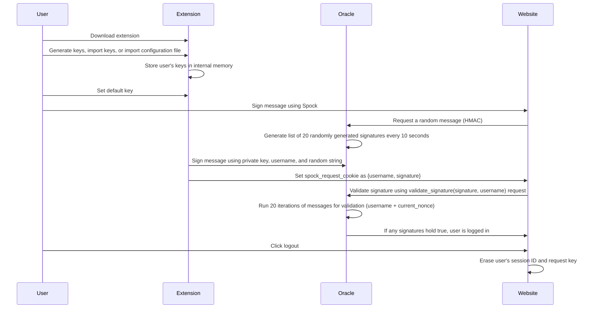

## Project Summary

Spock: Passwordless cryptographic signature login
Spock is a browser extension and SDK that offers passwordless authentication using public/private ECDSA keys. This technology allows users to securely sign in to websites and applications without the need for a traditional username and password.

With Spock, a user generates a public/private ECDSA key pair that is securely stored on their device. When they want to log in to a website or application that uses Spock, they simply sign a challenge with their private key, which is then verified by the server using the user’s public key.

Spock can be easily integrated into any web application using its SDK, offering developers a simple way to offer secure and convenient passwordless authentication to their users. By eliminating the need for traditional passwords, Spock aims to provide a more user-friendly and secure login experience for both users and developers.

**Edit: The extension points to a centralised database currently! Will shortly update it with it pointing to the Oracle!**


https://github.com/SpockExtension/Spock/assets/36011576/44e525b6-4c3a-4df4-a769-a68135184ae9




Deliverables

1. Spock browser extension: This would be a browser extension for popular web browsers like Chrome, Firefox, and Safari. The extension would provide users with a convenient and easy-to-use interface for generating and managing their ECDSA key pairs.

2. Spock SDK: This would be a software development kit that allows developers to integrate Spock into their web applications. The SDK would provide the necessary tools and documentation for developers to implement passwordless authentication using the Spock protocol.

3. Spock API: This would be an API that allows developers to access and manage user data for authentication and authorization purposes. The API could be used to store and retrieve user information, manage access controls, and provide other security-related features.

4. Documentation and support: Spock would need to provide comprehensive documentation and support for both users and developers. This would include user guides, developer guides, API documentation, and a knowledge base with troubleshooting guides and frequently asked questions.

5. Testing and quality assurance: Spock would need to be rigorously tested to ensure that it is secure, reliable, and compatible with different browsers and web applications. This would involve a combination of automated and manual testing, as well as code reviews and security audits to identify and address potential vulnerabilities.

Overall, the deliverables for Spock would aim to provide a complete and user-friendly passwordless authentication solution for web applications and their users.

How it works
1. User signs message (selects a private key loaded from config file, enters userName and TTL)
2. ECDSA public message is formed with username+privKey+timeStamp+TTL
3. Server side recalcuates message
4. If messages match, token generated

## Contributing to the project

First, run the development server:

```bash
pnpm dev
# or
npm run dev
```

Open the browser and load the appropriate development build. For example, if you are developing for the chrome browser, using manifest v3, use: `build/chrome-mv3-dev`.

You can start editing the popup by modifying `popup.tsx`. It should auto-update as you make changes. To add an options page, simply add a `options.tsx` file to the root of the project, with a react component default exported. Likewise to add a content page, add a `content.ts` file to the root of the project, importing some module and do some logic, then reload the extension on the browser.

## Making production build

Run the following:

```bash
pnpm build
# or
npm run build
```

This should create a production bundle for the extension, and sideload it.
